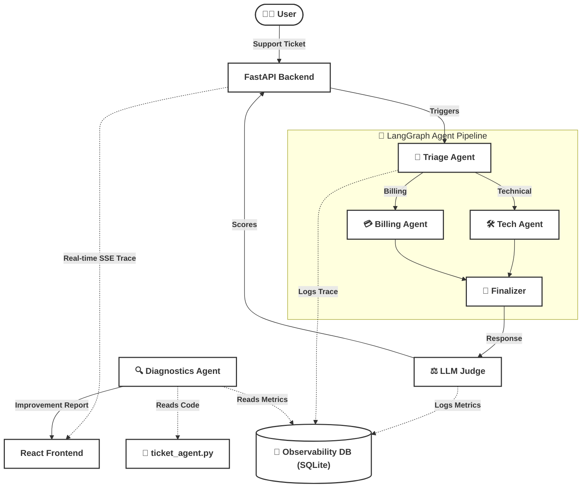

# 🔍 Observability-Driven LLM Agents

> **Build → Measure → Improve**: A dynamic, LangGraph-powered multi-agent customer support system. It comes with a built-in React UI that visualizes real-time execution traces, LLM-as-a-Judge evaluations, and programmatic "V1 vs V2" systemic prompt improvements.

[](https://www.python.org/)
[](https://fastapi.tiangolo.com/)
[](https://react.dev/)
[](https://ai.google.dev/)

---

## ✨ Features

| Feature                          | Description                                                                                           |
| -------------------------------- | ----------------------------------------------------------------------------------------------------- |
| 🤖**Multi-Agent Pipeline** | Uses LangGraph to route and execute technical or billing support queries.                             |
| ⚖️**LLM-as-a-Judge**     | Automatically evaluates every agent response for Router Accuracy, Response Accuracy, and Conciseness. |
| 📡**Real-time Tracing**    | Server-Sent Events (SSE) stream the step-by-step agent workflow live to the UI.                       |
| 📊**Observability DB**     | Logs all traces, latencies, token counts, and LLM evaluations to SQLite.                              |
| 🔄**V1 vs V2 Toggle**      | Live-switch between a "bad" V1 agent and an "optimized" V2 agent to see metric improvements.          |
| 🛠️**Diagnostics Agent**  | An AI Analyst that reads the SQLite metrics and codebase to suggest systemic prompt fixes.            |

---

## 🛠️ Tech Stack & Models

- **Backend:** FastAPI, Python, SQLite
- **Frontend:** React, Vite, CSS Modules
- **Agent Orchestration:** LangGraph, LangChain
- **Models Used:**
  - `gemini-3.1-flash-lite`: Used for all Multi-Agent nodes (Triage, Technical, Billing, Finalizer) and the Diagnostics Agent.
  - `gemini-3.1-flash-lite`: Used for the LLM-as-a-Judge evaluator.

---

## 🏗️ Architecture



---

## 📁 Project Structure

```text
Observability/
├── backend/
│   ├── api.py              # FastAPI server and SSE endpoints
│   ├── config.py           # Model and environment config
│   ├── database.py         # SQLite connection and trace context managers
│   ├── diagnostics.py      # LLM Data Analyst for systemic reporting
│   ├── evaluate.py         # LLM-as-a-Judge evaluation logic
│   └── ticket_agent.py     # LangGraph multi-agent pipeline
├── frontend/
│   ├── vite.config.js      # Vite config with backend proxy
│   └── src/
│       ├── App.jsx         # React UI for tracing and toggling versions
│       ├── App.css         # Styling and metric boxes
│       └── main.jsx
├── .env.example            # Environment variable template
├── .gitignore            
└── README.md
```

---

## 🚀 Quick Start

### Prerequisites

- Python 3.10+
- Node.js 18+
- A [Google AI Studio](https://aistudio.google.com/) API key

### 1. Clone & Configure

```bash
git clone https://github.com/Proxy-Pointer/Observability.git
cd Observability
cp .env.example .env
# Edit .env and paste your GOOGLE_API_KEY
```

### 2. Start the Backend

```bash
cd backend
python -m venv venv
# Windows:
venv\Scripts\activate
# macOS/Linux:
source venv/bin/activate

pip install -r requirements.txt
python api.py
# Starts on http://localhost:8001
```

### 3. Start the Frontend

In a new terminal:

```bash
cd frontend
npm install
npm run dev
# Opens http://localhost:5173
```

---

## 🔑 Configuration & Environment

### Environment Variables
Copy `.env.example` to `.env` and fill in your values:

```env
GOOGLE_API_KEY=your_google_api_key_here
```

### Model Configuration
All model versions are centralized in [`backend/config.py`](file:///c:/TDS/Code/Observability/backend/config.py). You can change these to test different models for the multi-agent pipeline vs the judge:

```python
AGENT_MODEL = "gemini-3.1-flash-lite"
JUDGE_MODEL = "gemini-3.1-flash-lite"
```

---

## 📄 License

MIT License
